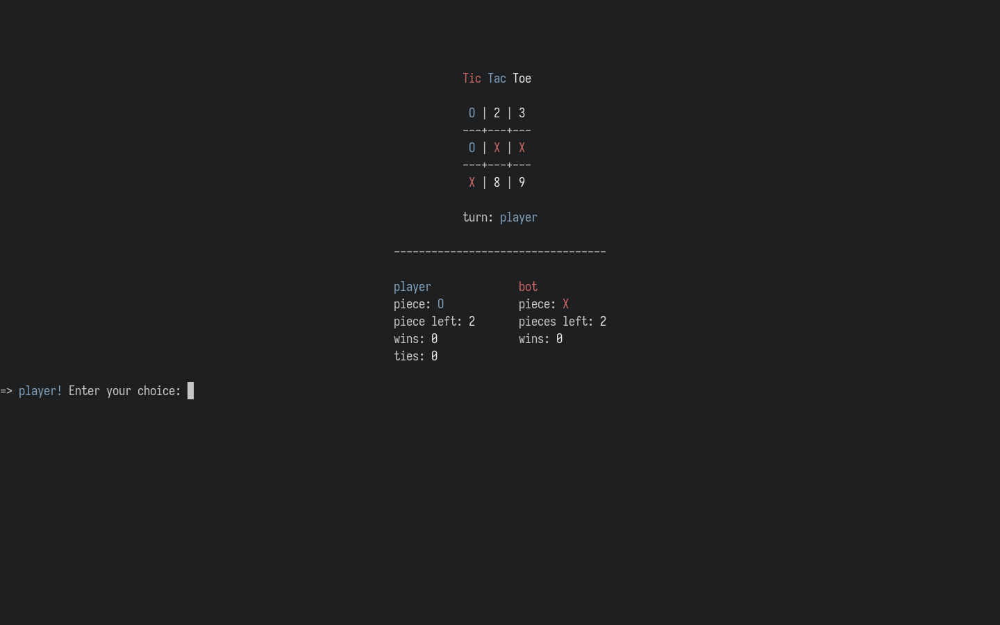

# tic-tac-toe



## About

`tic-tac-toe` is a simple terminal tic tac toe game with a colorized interface, where the player competes against the computer. Pieces left to play, wins, loses, and ties are tracked.

Who makes the first play is decided at random at the beginning of each round. You may choose to play as many rounds as you like.

## Dependencies

`tic-tac-toe` requires the following:

- `Ruby (>= 2.5.5)` (The programming language `tic-cac-toe` is written in. See [the official Ruby installation procedures](https://www.ruby-lang.org/en/documentation/installation/).)

- `bundler` (A Ruby gem for handling project dependencies. Install by running `$ gem install bundler` after `Ruby` has been installed.)

- `tput` (Used to check the size of the terminal `tic-tac-toe` is run withing. Installed by default on most Linux distributions.)

## Installation

To install `tic-tac-toe`, simply clone this repository to your machine, navigate to the `tic-tac-toe` folder created, and use `bundler` to install the needed dependencies as shown below:

```
$ git clone https://github.com/loreandstory/tic-tac-toe.git
$ cd tic-tac-toe/
$ bundle install
```

## Running

You must be `cd`'d into the `tic-tac-toe` folder and execute `play.sh` to play:

```
$ cd /path/to/tic-tac-toe/
$ ./play.sh
```

Note that you can exit the game at any time by pressing `Ctrl-c`. Otherwise, you may enter `n` at the end of each round to exit, or enter `y` to play another round.
